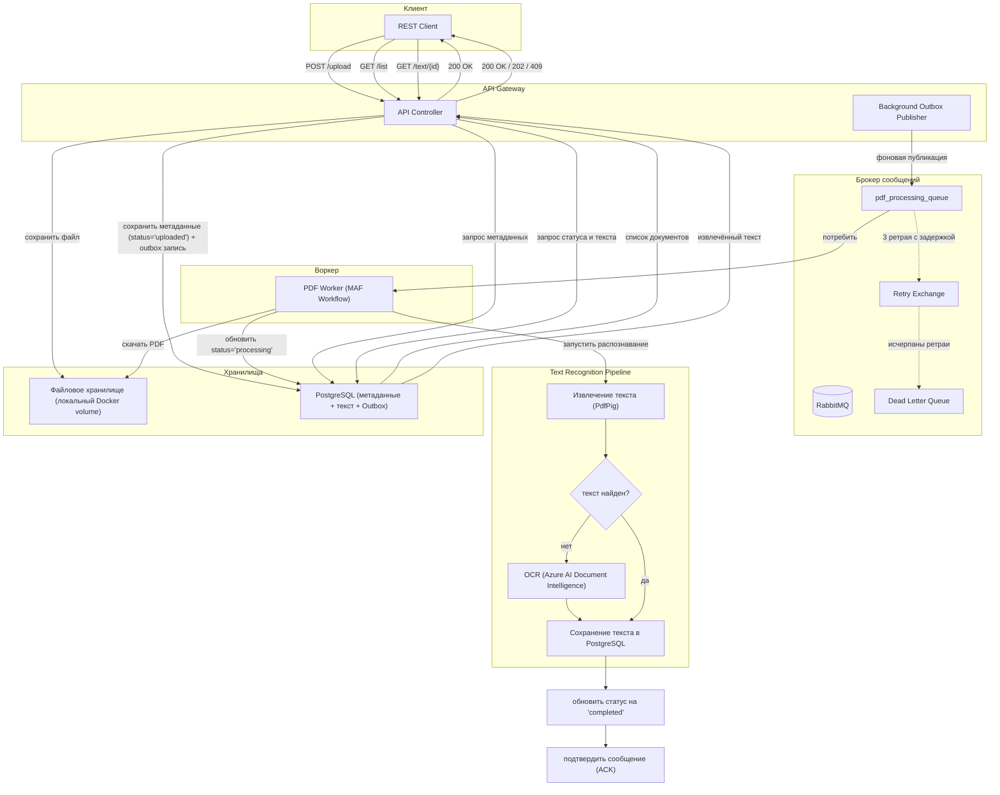

# ADR-001: Архитектура системы обработки PDF-документов

| **Статус** | **Дата** | **Автор** |
|------------|----------|-----------|
| Принято | 2025-05-08 | Черников Дмитрий |

## Контекст (условия задачи)

Необходимо реализовать систему из двух сервисов:
- **API Gateway** – REST API (загрузка PDF, получение списка, получение текста).
- **Background Worker** – обработка сообщений из RabbitMQ, извлечение текста из PDF, сохранение в PostgreSQL, обновление статуса.

**Технологии:** C#, ASP.NET Core, PostgreSQL, RabbitMQ, Docker.

**Основной фокус:** backend, архитектура, работа с очередями, работа с БД.

**Дополнительные цели (от автора решения):**
- Продемонстрировать умения в **system design** и архитектуре.
- Показать навыки работы с **современными технологиями**.
- Обеспечить возможность расширения функционала через добавление новых агентов (NER, перевод, суммаризация).
- Показать возможность умного роутинга на основе извлечённого текста с применением AI-методов.

## Решение (базовая архитектура)



## Архитектурные решения

### 1. Асинхронная обработка через RabbitMQ
Gateway и Worker развязаны через очередь сообщений. Клиент получает ответ 202 Accepted сразу после загрузки документа. Это обеспечивает отзывчивость системы при пиковых нагрузках и позволяет масштабировать сервисы независимо.

### 2. Transactional Outbox для атомарности
Проблема: при сбое между сохранением файла и публикацией сообщения документ мог навсегда остаться в статусе `uploaded`.

**Решение:**  
Вместо прямой публикации в RabbitMQ Gateway записывает команду в таблицу `outbox` в той же транзакции, что и метаданные документа. Фоновый сервис `OutboxPublisher` периодически забирает неподтверждённые записи и публикует их в очередь。 Это гарантирует: либо и файл, и метаданные, и сообщение будут сохранены атомарно – либо ничего. **Рекомендуемые реализации:** MassTransit Outbox, библиотека CAP или ручная реализация на EF Core.

### 3. Абстракция файлового хранилища (IFileStorage)
В MVP для простоты используется **локальный Docker volume** — общий том, смонтированный в контейнеры Gateway и Worker. Это устраняет необходимость в MinIO/S3 для начальной разработки и тестирования.

**Решение:** абстракция `IFileStorage` с единственной реализацией `LocalFileStorage` в MVP. Код спроектирован так, что в production реализацию можно заменить на **MinIO или S3** без изменения бизнес-логики — нужно только добавить `MinioFileStorage` и переключить `Storage__Provider` в конфигурации.

### 4. Статусная модель документа с конкурентным взятием
Статусы: `uploaded` → `processing` → `completed` / `failed`.

При получении сообщения Worker немедленно обновляет статус на `processing` (и сохраняет `started_at`). Чтобы избежать двойной обработки, обновление выполняется только если текущий статус `uploaded` (оптимистичная блокировка или `UPDATE ... WHERE status='uploaded'`). При успешном обновлении – продолжается обработка.

### 5. Механизм ретраев с задержкой и DLQ
**Количество ретраев:** 3. Схема:
1. При первом сбое сообщение отправляется в очередь `retry` с задержкой (например, 5 секунд).
2. При повторном сбое – задержка 30 секунд.
3. При третьем сбое – задержка 60 секунд.
4. После трёх неудачных попыток сообщение направляется в Dead Letter Queue для последующего анализа.

Такая схема предотвращает мгновенный повтор при временных сбоях (проблемы с БД, сетью) и даёт системе время на восстановление.

### 6. Idempotent Consumer
Распределённые системы могут доставлять дубликаты сообщений. **Решение:** Worker проверяет уникальный идентификатор сообщения (`MessageId`) перед обработкой. Альтернатива: проверять статус документа – если уже `completed`, просто подтвердить сообщение без повторной обработки.

### 7. OCR с fallback: экономия через SaaS-вызов только по необходимости
- **PdfPig** используется для текстовых PDF (бесплатно, быстро).
- Вызов Azure AI Document Intelligence происходит **только если**:
  - Текст после PdfPig пустой (скан-копия).
  - OR для документов, явно помеченных как требующие OCR.
- Azure Document Intelligence – платный сервис, поэтому вызов по запросу минимизирует затраты.

**Azure AI Document Intelligence F0 (бесплатный тариф)** – подходит для MVP:
- Максимальный размер файла: 4 MB.
- Анализируются только первые 2 страницы в одном запросе.
- Частота: до 1 запроса в секунду, 500 страниц в месяц.
- Для production документы разбиваются на чанки по 2 страницы или переходят на платный тариф S0.

### 8. Расширяемость через агентов и AI-роутинг
Архитектура с Microsoft Agent Framework (MAF) позволяет добавлять новых агентов без изменения Gateway:
- Агент перевода текста.
- Агент суммаризации.
- Агент извлечения сущностей (NER).
- AI-роутер на основе LLM или BERT для маршрутизации документов в разные очереди (`legal`, `accounting`).

## Формат команды в RabbitMQ

```json
{
    "DocumentId": "3fa85f64-5717-4562-b3fc-2c963f66afa6",
    "FilePath": "pdfs/3fa85f64-5717-4562-b3fc-2c963f66afa6.pdf",
    "RetryCount": 0,
    "MessageId": "msg-3fa85f64-5717-4562-b3fc-2c963f66afa6-1736000000"
}
```

`MessageId` используется для идемпотентности, `RetryCount` – для управления ретраями.

## Обработка Dead Letter Queue
- Сообщения в DLQ логируются с полными метаданными ошибки.
- Настроен мониторинг длины DLQ (алерт при превышении порога).
- Предусмотрен инструмент ручного сброса (replay) после исправления причины ошибки.
- Рекомендуется: дашборд с DLQ-метриками и экспорт данных для анализа.

## Параллелизм и ограничения

| Параметр | Значение | Обоснование |
|----------|---------|-------------|
| `prefetchCount` | 1 | Предотвращает перегрузку Worker несколькими сообщениями одновременно. Worker забирает следующее сообщение только после ACK предыдущего. |
| `SemaphoreSlim` в Worker | опционально | Дополнительный слой ограничения параллелизма внутри одного экземпляра. |
| Макс. размер файла (MVP) | 4 MB | Соответствует лимиту Azure AI Document Intelligence F0. |
| Макс. размер файла (production) | >4 MB через MinIO/S3 или локальный кластер | При разбиении на чанки или отказе от OCR. |

## Graceful Shutdown
При останове Worker:
1. Останавливается приём новых сообщений (прекращается вызов `BasicConsume`).
2. Завершаются текущие обработки (ожидание до таймаута).
3. Для незавершённых сообщений ACK не отправляется – RabbitMQ переотправит их другому Worker или сохранит для следующего запуска.
4. Закрываются соединения с RabbitMQ, БД и хранилищем.

## Мониторинг (production)
- **Метрики Prometheus:** длина очереди, время обработки документа (гистограмма), количество ошибок по типам, статусы документов.
- **Health checks:** `/health/ready` (готовность принимать трафик), `/health/live` (работоспособность процесса).
- **Дашборд Grafana** с панелями по статусам и задержкам.
- **Alerting:** превышение длины DLQ, долгое зависание в статусе `processing`.

## Последствия (Consequences)

### Что меняется в проекте
- **Усложнение развёртки:** добавляется RabbitMQ и файловое хранилище (локальный Docker volume в MVP, MinIO/S3 — опционально в production).
- **Дополнительные зависимости:** библиотеки для работы с очередями (например, MassTransit) и облачным хранилищем.
- **Настройка политик ретраев:** требуется кастомизация параметров очередей и обменов в RabbitMQ.

### Риски
- При отказе RabbitMQ система становится неработоспособной → требуется настройка репликации (для production). Файловое хранилище на локальном томе — точка отказа для HA, но для MVP допустимо.
- Azure AI Document Intelligence зависит от интернета и платного аккаунта → для офлайн/MVP – заглушка или Tesseract через `IOCRService`.
- MAF – относительно новая технология ⌊Microsoft Agent Framework (Preview)⌋, в production требуются дополнительные профильные экспертизы.

### Что нужно донести до команды
- При работе с очередями принципиально важны идемпотентность потребителей и мониторинг DLQ.
- Лимиты Azure F0 – не для производственной нагрузки: при переходе в production необходимы разбиение документов на чанки или апгрейд до платного тарифа S0.
- Код должен писать структурированные логи (например, Serilog) с корреляцией (`DocumentId`), чтобы трассировать жизненный цикл документа через все сервисы.

## Альтернативы, рассмотренные и отклонённые

### Альтернатива 1: Мастер-воркер с MassTransit и Tesseract (локальный OCR)
**Суть:** API Gateway через MassTransit публикует задание. Worker – мастер-воркер: получает PDF, разбивает на страницы и отправляет подзадачи в очередь `PageProcessing`. Несколько воркеров конкурентно извлекают текст через PdfPig (текстовые PDF) или Tesseract (скан-копии, без Azure). Metastatus, извлечённый текст – PostgreSQL.

**Почему отклонена:**
- Tesseract требует предварительной конвертации PDF в изображение, качество распознавания ниже, чем у Azure AI.
- Мастер-воркер и постраничная обработка усложняют код и увеличивают задержки.
- MAF + Azure OCR проще в реализации и даёт лучшее качество распознавания для MVP.

### Альтернатива 2: Plain consumers без MAF (ручное управление очередью)
**Суть:** Обычный `IHostedService`, который вручную подписывается на RabbitMQ, управляет ретраями через try-catch, ограничивает конкурентность через `SemaphoreSlim`. Статусы и текст сохраняются напрямую.

**Почему отклонена:**
- MAF даёт декларативные workflow, встроенные checkpoint и retry, что снижает объём шаблонного кода.
- При добавлении новых шагов (перевод, суммаризация) в plain-реализации придётся писать сложную машину состояний.

## Плюсы решения

1. **Чёткое разделение ответственности** – Gateway только приём и публикация, Worker – тяжёлая обработка. Сервисы масштабируются независимо.

2. **Атомарность через Outbox** – сообщение публикуется после коммита транзакции, потеря сообщений исключена.

3. **Отказоустойчивость на уровне очереди** – 3 ретрия с задержкой + DLQ: временный сбой отрабатывается автоматически, постоянный – попадает в очередь для анализа.

4. **Экономичный OCR** – PdfPig для текстовых PDF, Azure AI Document Intelligence только при необходимости.

5. **Статусная модель документа** – клиент опрашивает `GET /pdfs/{id}/text` и получает `200 OK` (готово), `202 Accepted` (в обработке) или `409 Conflict` (ошибка).

6. **Идемпотентность обработки** – дубликаты сообщений не нарушают состояние документа.

7. **Расширяемость через MAF** – добавление новых агентов (перевод, суммаризация, классификация) не требует изменения Gateway.

8. **Горизонтальная масштабируемость** – очередь сообщений позволяет запускать несколько экземпляров Gateway и Worker. Для горизонтального масштабирования в production требуется объектное хранилище (MinIO/S3), в MVP достаточно общего Docker volume.

## Минусы решения и их смягчение

| Минус | Смягчение |
|-------|------------|
| **Избыточная сложность для тестовой задачи** | Задача требует демонстрации архитектурных навыков, сложность оправдана. |
| **Отсутствие гарантии exactly-once (at-most-once может привести к дублям)** | Worker – идемпотентный потребитель, повторная обработка не нарушает состояние. |
| **OCR зависит от внешнего платного сервиса** | Абстракция `IOCRService` позволяет переключиться на Tesseract (бесплатно) или IronOCR, либо вызывать Azure только по запросу (экономия). |
| **Мониторинг не реализован** | Добавить Prometheus + Grafana как часть production-буста. |
| **Ограничения бесплатного Azure F0** | В Worker реализовать разбиение документа на части по 2 страницы. Файлы >4 MB отклонять на входе. |
| **MAF – относительно новая технология** | Оставаться в рамках документированных паттернов, иметь fallback-реализацию на plain consumers. Минимизировать vendor lock-in через абстракции. |

## Планируемые улучшения (production-буст)

| Улучшение | Реализация | Приоритет |
|-----------|------------|-----------|
| **Idempotency через таблицу обработанных сообщений** | Сохранять `MessageId` и результат обработки; перед обработкой проверять дубликаты. | Высокий |
| **Мониторинг** | Prometheus метрики (длина очереди, время обработки, статусы), Grafana дашборды. | Средний |
| **Callback webhook** | Поле `callback_url` при загрузке – POST на него после завершения. | Низкий |
| **Health checks** | `/health/ready`, `/health/live` для K8s/Docker. | Высокий |
| **Чанкинг документов для Azure F0** | Разбивка PDF на части по 2 страницы, склеивание результата. | Средний |
| **AI-роутинг** | Отдельный агент-подписчик, использующий LLM для классификации текста. | Средний (показательный) |

## Итог

Предложенная архитектура **полностью удовлетворяет функциональным требованиям** тестового задания. Она:

- Демонстрирует **системное мышление** (разделение сервисов, очереди, DLQ, статусы, Transactional Outbox for atomicity).
- Использует **современный стек** (Microsoft Agent Framework, Azure AI, .NET 8, Docker).
- **Расширяема** – добавление новых агентов не требует переписывания ядра.
- **Готова к production-улучшениям** (мониторинг, идемпотентность, AI-роутинг).

---

**Дата принятия:** 2025-05-08  
**Автор:** Черников Дмитрий  
**Утверждено:** для реализации MVP с последующим улучшением
