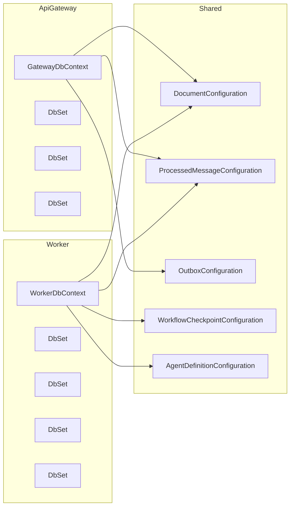

# ADR-002: Использование композиции для DbContext вместо наследования или дублирования

| **Статус** | **Дата** | **Автор** |
|------------|----------|-----------|
| Принято | 2026-05-15 | Черников Дмитрий |

## Контекст (условия задачи)

В системе имеется два сервиса: **ApiGateway** и **Worker**. Оба используют единую базу данных PostgreSQL, но работают с разными наборами таблиц:

| Таблица | ApiGateway | Worker |
|---------|------------|--------|
| `documents` | ✅ (чтение/запись) | ✅ (чтение/запись) |
| `processed_messages` | ✅ (чтение/запись) | ✅ (чтение/запись) |
| `outbox` | ✅ (только запись) | ❌ |
| `workflow_checkpoints` | ❌ | ✅ |
| `agent_definitions` | ❌ | ✅ |

Первоначально в MVP была **отдельная реализация DbContext в каждом сервисе** без общего кода. Это привело к дублированию конфигураций общих сущностей (`documents`, `processed_messages`). Позже была предпринята попытка использовать **наследование от базового класса `Shared.AppDbContext`**, чтобы сократить дублирование. Однако наследование создало проблемы с миграциями (конфликт создания одних и тех же таблиц) и нарушило принцип разделения ответственности (базовый класс «знал» о всех таблицах).

Теперь система выходит за рамки MVP, ожидается развитие и, возможно, появление новых сервисов. Необходимо выбрать устойчивое архитектурное решение для работы с DbContext.

## Решение (композиция)

**Принято решение использовать композицию** через:
- Вынос всех конфигураций сущностей в `Shared/Configurations` в виде классов, реализующих `IEntityTypeConfiguration<T>`.
- Создание отдельного `DbContext` для каждого сервиса, который применяет только необходимые конфигурации.
- Назначение одного сервиса (ApiGateway) владельцем миграций для общих таблиц (`documents`, `processed_messages`). Worker использует эти таблицы через существующую схему, не создавая миграции для них.

### Архитектурная схема композиции



### Ключевые элементы реализации

1. **Конфигурации сущностей в Shared**  
   Каждая сущность получает отдельный конфигурационный класс, расположенный в папке `Shared/Configurations`. Конфигурации содержат имя таблицы, ключи, индексы, ограничения и типы колонок.

2. **GatewayDbContext (владелец общих таблиц)**  
   - Определяет `DbSet` для `Document`, `ProcessedMessage`, `OutboxMessage`.
   - В `OnModelCreating` применяет соответствующие конфигурации.
   - Миграции создаются только для этого контекста. Он отвечает за создание и обновление схемы для `documents` и `processed_messages`.

3. **WorkerDbContext (потребитель общих таблиц)**  
   - Определяет `DbSet` для `Document`, `ProcessedMessage`, `WorkflowCheckpoint`, `AgentDefinition`.
   - Применяет конфигурации всех используемых сущностей.
   - **Не создаёт миграции** для общих таблиц (полагается на `GatewayDbContext`). При необходимости может иметь собственные миграции только для своих уникальных таблиц, но в production миграции не применяются (или применяются с осторожностью).

4. **Управление миграциями**  
   - В `Program.cs` ApiGateway вызывается `dbContext.Database.MigrateAsync()` – создаёт/обновляет общую схему.
   - В `Program.cs` Worker **не вызывается** `MigrateAsync()`. Вместо этого используется `dbContext.Database.EnsureCreated()` (только для разработки) или полагается на существование схемы. В production Worker просто подключается к уже подготовленной базе.

### Код примера

**Shared/Configurations/DocumentConfiguration.cs**
```csharp
public class DocumentConfiguration : IEntityTypeConfiguration<DocumentDto>
{
    public void Configure(EntityTypeBuilder<DocumentDto> builder)
    {
        builder.ToTable("documents");
        builder.HasKey(e => e.Id);
        builder.Property(e => e.Filename).HasMaxLength(512).IsRequired();
        builder.Property(e => e.Status).HasConversion<int>().IsRequired();
        builder.Property(e => e.FilePath).HasMaxLength(1024).IsRequired();
        builder.Property(e => e.CreatedAt).IsRequired();
    }
}
```

**ApiGateway/Data/GatewayDbContext.cs**
```csharp
public class GatewayDbContext : DbContext
{
    public GatewayDbContext(DbContextOptions<GatewayDbContext> options) : base(options) { }
    public DbSet<DocumentDto> Documents => Set<DocumentDto>();
    public DbSet<ProcessedMessage> ProcessedMessages => Set<ProcessedMessage>();
    public DbSet<OutboxMessage> OutboxMessages => Set<OutboxMessage>();

    protected override void OnModelCreating(ModelBuilder modelBuilder)
    {
        modelBuilder.ApplyConfiguration(new DocumentConfiguration());
        modelBuilder.ApplyConfiguration(new ProcessedMessageConfiguration());
        modelBuilder.ApplyConfiguration(new OutboxConfiguration());
    }
}
```

**Worker/Data/WorkerDbContext.cs**
```csharp
public class WorkerDbContext : DbContext
{
    public WorkerDbContext(DbContextOptions<WorkerDbContext> options) : base(options) { }
    public DbSet<DocumentDto> Documents => Set<DocumentDto>();
    public DbSet<ProcessedMessage> ProcessedMessages => Set<ProcessedMessage>();
    public DbSet<WorkflowCheckpoint> WorkflowCheckpoints => Set<WorkflowCheckpoint>();
    public DbSet<AgentDefinition> AgentDefinitions => Set<AgentDefinition>();

    protected override void OnModelCreating(ModelBuilder modelBuilder)
    {
        modelBuilder.ApplyConfiguration(new DocumentConfiguration());
        modelBuilder.ApplyConfiguration(new ProcessedMessageConfiguration());
        modelBuilder.ApplyConfiguration(new WorkflowCheckpointConfiguration());
        modelBuilder.ApplyConfiguration(new AgentDefinitionConfiguration());
    }
}
```

## Альтернативы, рассмотренные и отклонённые

### Альтернатива 1: Отдельная реализация в каждом сервисе (без общего кода)

**Суть:** Каждый сервис содержит свой собственный `DbContext`, полностью независимо определяющий нужные сущности и их конфигурации. Общие таблицы (`documents`, `processed_messages`) описываются дважды (в ApiGateway и в Worker).

**Плюсы:**
- Полная независимость сервисов.
- Миграции не конфликтуют (каждый сервис свою схему создаёт отдельно – но в реальности при одной БД это приведёт к конфликту создания одних и тех же таблиц).
- Простота понимания (нет shared-зависимостей).

**Минусы:**
- **Дублирование кода** – конфигурации общих таблиц повторяются. При изменении схемы нужно править в двух местах.
- **Рассогласование** – можно случайно изменить конфигурацию в одном сервисе, а во втором забыть, что вызовет ошибки времени выполнения.
- **Проблема миграций** – при одной БД оба контекста попытаются создать одни и те же таблицы, что приведёт к ошибке `already exists`. Решение – ручное управление миграциями (один контекст «владелец», второй – игнорирует общие таблицы). Но это не очевидно из кода.

**Почему отклонена:** Дублирование и риск рассинхронизации неприемлемы для проекта, выходящего за рамки MVP. Подход не масштабируется при добавлении третьего сервиса.

### Альтернатива 2: Наследование от общего базового DbContext

**Суть:** Создаётся базовый класс `Shared.AppDbContext`, содержащий общие `DbSet` и их конфигурации. ApiGateway и Worker наследуют от него и добавляют свои таблицы. Используется текущая реализация (до принятия ADR-002).

**Плюсы:**
- Устранено дублирование общих таблиц.
- Единое место изменения схемы общих сущностей.
- Простота добавления новых таблиц в базовый класс.

**Минусы:**
- **Проблема миграций** – EF Core при создании миграции для наследника пытается включить в неё все таблицы из базового класса. При запуске миграции в ApiGateway и Worker будут попытки повторно создать `documents` и `processed_messages`. Это приводит к конфликтам или дублирующемуся коду миграций.
- **Нарушение SRP** – базовый класс «знает» о таблицах обоих сервисов. Изменение в Worker (например, новое поле в `workflow_checkpoints`) требует изменения общего класса, хотя ApiGateway это не нужно.
- **Сложность тестирования** – невозможно изолированно протестировать WorkerDbContext без поднятия всей схемы ApiGateway.
- **Разрастание базового класса** – при добавлении новых сервисов все таблицы будут скапливаться в одном месте, создавая «God DbContext».

**Почему отклонена:** Наследование DbContext в EF Core – признанный анти-паттерн для production-проектов с общей БД. Проблемы с миграциями и нарушение SRP перевешивают удобство устранения дублирования.

## Плюсы решения (композиция)

1. **Устранение дублирования** – конфигурации вынесены в Shared и переиспользуются. Изменение схемы общих таблиц происходит в одном месте.
2. **Разделение ответственности** – каждый сервис определяет только те таблицы, которые ему нужны. Нет «знания» о чужих сущностях.
3. **Чистые миграции** – только один сервис (ApiGateway) управляет схемой общих таблиц. Worker не создаёт миграций для `documents` и `processed_messages`, что исключает конфликты.
4. **Гибкость** – при добавлении нового сервиса (например, ReportingService) достаточно создать его собственный `DbContext` и применить нужные конфигурации. Не нужно менять общий базовый класс.
5. **Тестируемость** – каждый контекст можно тестировать изолированно (InMemory, Testcontainers) с минимальным набором сущностей.
6. **Поддержка разных СУБД в будущем** – если потребуется разнести базы данных, это будет легко сделать, так как контексты полностью независимы.

## Минусы решения и их смягчение

| Минус | Смягчение |
|-------|-----------|
| **Небольшое дублирование кода** – каждый контекст всё равно объявляет `DbSet` для общих сущностей. | Объём кода мал, явное объявление повышает читаемость и инкапсуляцию. Это не дублирование логики, а декларация зависимостей. |
| **Риск несинхронного применения конфигураций** – можно в одном сервисе применить устаревшую конфигурацию. | Конфигурации берутся из общей папки `Shared/Configurations`. Если конфигурация изменена, она автоматически изменится для всех. |
| **Worker не управляет миграциями общих таблиц** – при изменении схемы нужно помнить, что миграцию создаёт только ApiGateway. | Документировано в ADR и в коде (комментарии в `Program.cs` Worker). Автоматизированные тесты накатывают миграцию Gateway перед запуском тестов Worker. |
| **Дополнительная сложность для новичков** – нестандартный паттерн. | Композиция с `IEntityTypeConfiguration` – это стандартная рекомендация Microsoft. Документация и явные комментарии помогут. |

## Последствия (Consequences)

### Что меняется в проекте

- **Удаляются** существующие классы `Shared.AppDbContext` и наследники.
- **Создаётся** папка `Shared/Configurations` с классами конфигураций для всех сущностей.
- **Создаются** `ApiGateway/Data/GatewayDbContext` и `Worker/Data/WorkerDbContext` (новые имена, чтобы не путать со старыми).
- **Обновляется** `Program.cs` ApiGateway: остается вызов `MigrateAsync()`.
- **Обновляется** `Program.cs` Worker: убирается `MigrateAsync()`, при необходимости добавляется `EnsureCreated()` только для разработки или проверка существования схемы.
- **DI-регистрация** обновляется: вместо `Shared.AppDbContext` регистрируются `GatewayDbContext` и `WorkerDbContext`.

### Риски

- **При развёртывании новой версии** необходимо сначала запустить ApiGateway (чтобы применить миграции), затем Worker. В противном случае Worker может временно работать со старой схемой, что не критично, но может вызвать ошибки, если изменения ломающие. Это решается оркестрацией (Docker Compose с условиями, K8s initContainer).
- **Worker при старте не проверяет актуальность схемы** – если миграции не были накачены, Worker упадёт с ошибкой о несуществующей колонке. В production это контролируется последовательностью запуска.

### Что нужно донести до команды

- При добавлении новой таблицы или изменении существующей **конфигурация создаётся/изменяется в `Shared/Configurations`**.
- **Миграции** создаются только от `GatewayDbContext`. Команда: `dotnet ef migrations add --context GatewayDbContext --startup-project ApiGateway --project ApiGateway`.
- Worker **никогда не накатывает миграции на production**. Он только читает схему, созданную ApiGateway.
- Если в будущем потребуется, чтобы Worker владел своими уникальными таблицами (не общими), можно добавить миграции для `WorkerDbContext`, но перед этим нужно убедиться, что они не создают `documents` и `processed_messages` повторно. Это достигается удалением этих строк из миграции вручную или использованием `modelBuilder.Ignore<DocumentDto>()` в WorkerDbContext (тогда Worker вообще не будет знать об этих таблицах, и придётся работать через SQL или отдельный репозиторий).

## Итог

Композиция с вынесением конфигураций в `IEntityTypeConfiguration` и созданием отдельных `DbContext` для каждого сервиса признана наиболее подходящим архитектурным решением для развивающейся системы. Она обеспечивает:

- Отсутствие дублирования кода.
- Разделение ответственности.
- Управляемость миграций.
- Гибкость для добавления новых сервисов.

Альтернативы (отдельные реализации в каждом сервисе и наследование) отклонены из-за дублирования кода, конфликтов миграций и нарушения принципов SOLID.

---

**Дата принятия:** 2026-05-15  
**Автор:** Черников Дмитрий  
**Утверждено:** для реализации композиции во всех сервисах системы.